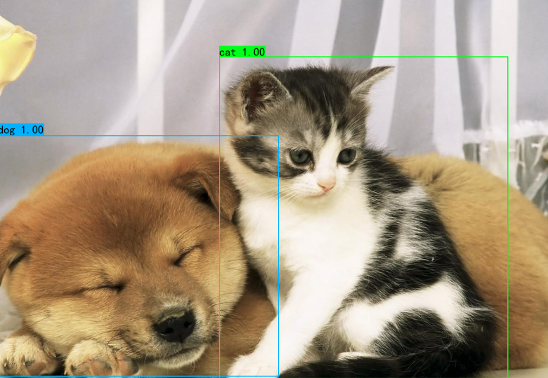
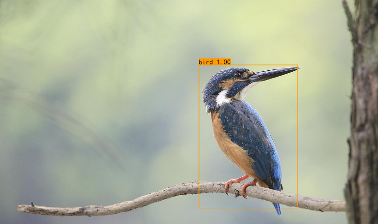
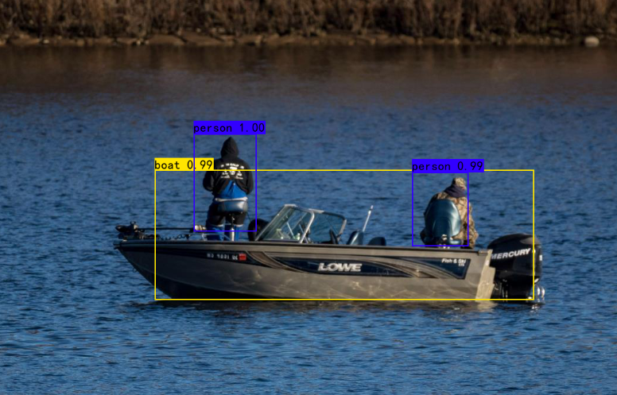
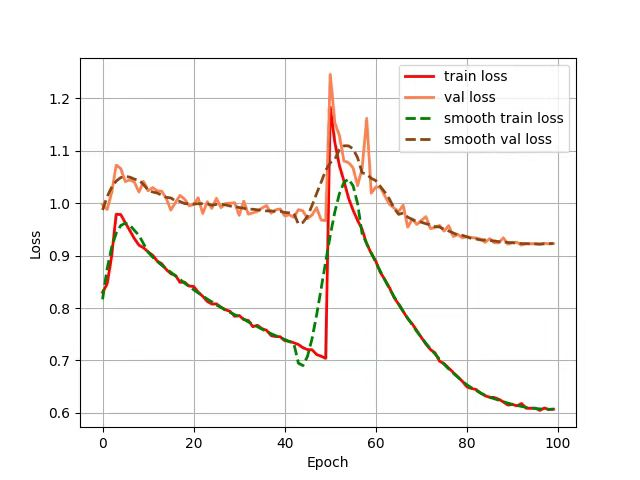

# Faster R-CNN在VOC2007数据集上的训练

## 实验环境准备

* clone来自于作者bubbliiiing的github repo代码，如：
```
git clone https://github.com/bubbliiiing/faster-rcnn-pytorch.git
```
* 创建虚拟环境
```
conda create -n rcnn python==3.9
pip install tensorboard
pip install opencv-python==4.3.0.38
pip install --user -i https://pypi.tuna.tsinghua.edu.cn/simple --trusted-host pypi.tuna.tsinghua.edu.cn opencv-python
pip install torch==1.6.0 torchvision==0.7.0 -f https://download.pytorch.org/whl/torch_stable.html
pip install -r requirements.txt
```

## 所需环境
* scipy==1.2.1
* numpy==1.17.0
* matplotlib==3.1.2
* opencv_python==4.1.2.30
* torch==1.2.0, 1.6.0
* torchvision==0.4.0, 0.7.0
* tqdm==4.60.0
* Pillow==8.2.0
* h5py==2.10.0

## 文件下载
*  voc_weights_vgg.pth是vgg为主干特征提取网络用到的，放置于目录model_data下： 
链接: https://pan.baidu.com/s/1S6wG8sEXBeoSec95NZxmlQ      
提取码: 8mgp    

* VOC数据集下载地址如下，里面已经包括了训练集、测试集、验证集（与测试集一样），无需再次划分：  
链接: https://pan.baidu.com/s/1-1Ej6dayrx3g0iAA88uY5A    
提取码: ph32  

## 训练VOC07+12数据集
1. 数据集的准备   
**本文使用VOC格式进行训练，训练前需要下载好VOC07+12的数据集，解压后放在根目录**  

2. 数据集的处理   
修改voc_annotation.py里面的annotation_mode=2，运行voc_annotation.py生成根目录下的2007_train.txt和2007_val.txt。   
```
 python voc_annotation.py
```

* Generate 2007_train.txt and 2007_val.txt for train.
* Generate 2007_train.txt and 2007_val.txt for train done.

| Object | Number |
| :-----| ----: 
|   aeroplane |  1456 | 
|     bicycle |  1401 | 
|        bird |  2064 | 
|        boat |  1403 |
|      bottle |  2233 |
|         bus |  1035 |
|         car |  4468 |
|         cat |  1951 |
|       chair |  3908 |
|         cow |  1091 |
| diningtable |  1030 |
|         dog |  2514 |
|       horse |  1420 |
|   motorbike |  1377 |
|      person | 17784 |
| pottedplant |  1967 |
|       sheep |  1312 |
|        sofa |  1053 |
|       train |  1207 |
|   tvmonitor |  1416 |

1. 开始网络训练   
* train.py的默认参数用于训练VOC数据集，直接运行train.py即可开始训练。   
```
python train.py
```
* RuntimeError: CUDA out of memory. Tried to allocate 88.00 MiB (GPU 0; 4.00 GiB total capacity; 236.91 MiB already allocated; 2.78 GiB free; 252.00 MiB reserved in total by PyTorch)
* 鉴于设备显卡能力有限，调整参数 epoch == 1，* 得到自己训练的权重: `model_data\best_epoch_weights_1.pth`

* 设置 epoch == 100， 得到训练权重`model_data\best_epoch_weights_100.pth`，后续仅呈现该情况的结果。
百度网盘链接: https://pan.baidu.com/s/1l3vy5qkIG66Ioo5qRGR_uQ 提取码: yhen 

### 预测步骤

#### 使用自己训练的权重
1. 按照训练步骤训练。  
2. 在frcnn.py文件里面，在如下部分修改model_path和classes_path使其对应训练好的文件；**model_path对应logs文件夹下面的权值文件，classes_path是model_path对应分的类**。  
```python
_defaults = {
    #--------------------------------------------------------------------------#
    #   使用自己训练好的模型进行预测一定要修改model_path和classes_path！
    #   model_path指向logs文件夹下的权值文件，classes_path指向model_data下的txt
    #   如果出现shape不匹配，同时要注意训练时的model_path和classes_path参数的修改
    #--------------------------------------------------------------------------#
    "model_path"    : 'model_data/voc_weights_resnet.pth',
    "classes_path"  : 'model_data/voc_classes.txt',
    #---------------------------------------------------------------------#
    #   网络的主干特征提取网络，resnet50或者vgg
    #---------------------------------------------------------------------#
    "backbone"      : "resnet50",
    #---------------------------------------------------------------------#
    #   只有得分大于置信度的预测框会被保留下来
    #---------------------------------------------------------------------#
    "confidence"    : 0.5,
    #---------------------------------------------------------------------#
    #   非极大抑制所用到的nms_iou大小
    #---------------------------------------------------------------------#
    "nms_iou"       : 0.3,
    #---------------------------------------------------------------------#
    #   用于指定先验框的大小
    #---------------------------------------------------------------------#
    'anchors_size'  : [8, 16, 32],
    #-------------------------------#
    #   是否使用Cuda
    #   没有GPU可以设置成False
    #-------------------------------#
    "cuda"          : True,
}
```
3. 运行predict.py，输入  
```python
img/1.jpg
```
4. 在predict.py里面进行设置可以进行fps测试和video视频检测。  
5. 训练结果预测   
训练结果预测需要用到两个文件，分别是frcnn.py和predict.py。我们首先需要去frcnn.py里面修改model_path以及classes_path，这两个参数必须要修改。   
**model_path指向训练好的权值文件，在logs文件夹里。   
classes_path指向检测类别所对应的txt。**   
完成修改后就可以运行predict.py进行检测了。运行后输入图片路径即可检测。   
)
)
)
6. LOSS 和 mAP

